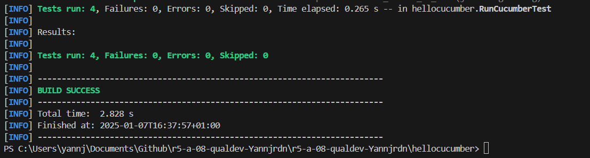
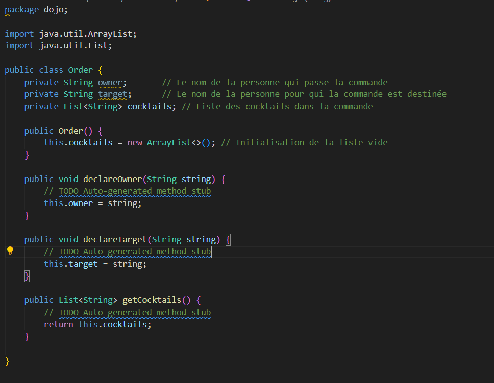
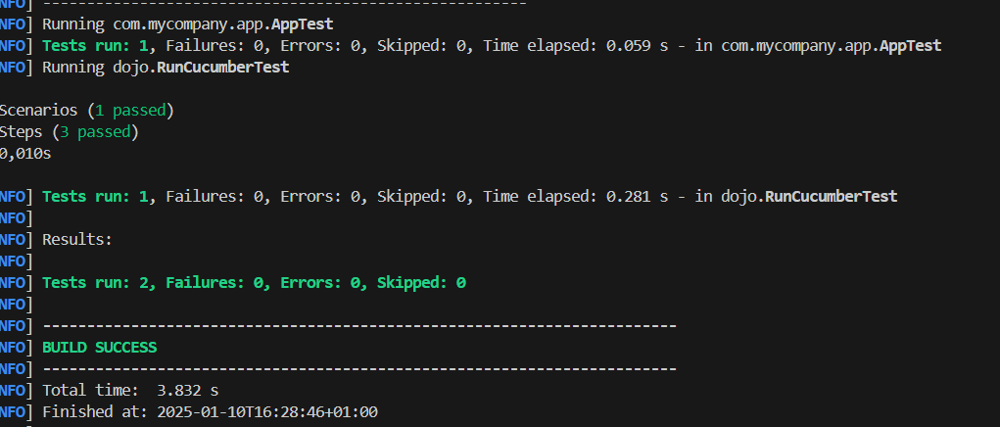

= R5.A.08 -- Dépôt pour les TPs
:icons: font
:MoSCoW: https://fr.wikipedia.org/wiki/M%C3%A9thode_MoSCoW[MoSCoW]

Ce dépôt concerne les rendus de mailto:A_changer@etu.univ-tlse2.fr[Jonh Doe].

== TP1

Code de is_it_friday_yet.feature
[source,java]
---
Feature: Is it Friday yet?
  Everybody wants to know when it's Friday

  Scenario Outline: Checking if today is Friday
    Given today is "<day>"
    When I ask whether it's Friday yet
    Then I should be told "<answer>"

    Examples:
      | day            | answer |
      | Friday         | TGIF   |
      | Sunday         | Nope   |
      | SuperMario     | Nope   |
---

.Exemple d'image insérée en asciidoc

== TP2...
.capture d'encrant TP2

